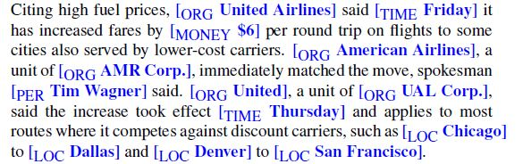
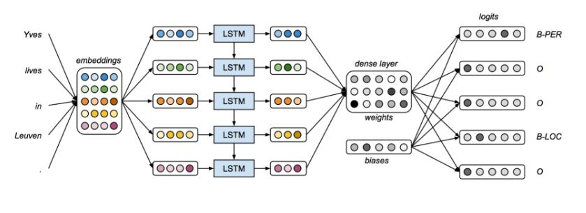

```{r setup, include=FALSE, echo=FALSE}
knitr::opts_chunk$set(echo = TRUE,
                      message = F,
                      warning = F, 
                      comment = NA)

```
#Introduction

## Motivation

<font size="4">
Suppose we care to take a document and extract the people, organizations, or locations mentioned in a particular section of text and how they relate to each other in the context of the document.  In the Harry Potter texts, we could attempt to gain insight about particular chapters or particular books when looking at which named entities are mentioned the most, when they are mentioned, or what other entities (or particular parts of speech) are mentioned in close sequence.  

In Bryan's project, he is looking at the last 25 years worth of State of the Union Addresses to see what trends exist across presidents and parties.  In addition to document summarization to generate a condensed version of each speech and topic modeling to "decode" the different common topics across the speeches, he could further analyze the text to see who and what each president mentions, how often, and in what context.  

The goal of Named Entity Recognition (NER) is the process of finding spans of text that constitute proper name then classify the type of entity. Named entities are anything that can be referred to with a proper noun: a person, a location, or an organization.  They have also been extended to include dates, times, and numerical expressions. Named entities can give insight to events in text, relationship between people in a text, and aid in other text mining techniques. For example, we may want to conduct sentiment analysis towards a certain entity. The following table displays a list of genereic named enitity types with the kind of enitites they refer to. 

<center>

</center>


Let's take one in class exercise and see what entities we come up with, and see what challenges and potential other text mining techniques we could use after NER.


One further example:

<center>
 
</center>


The example shown above blends NER, event coreference (which events mentioned in a document are the same event), temporal expressions (days of the weeks, months), entity linking (United Airlines vs. United).  While this lesson only delves into NER, this example shows some of the things that could be extracted to answer a question like: "Is there any relationship between one airline changing fare price followed by others doing to same thing?"


With the United Airlines example above, NER can break it down into the following entities based on their entity type.
<center>

</center>

## Uses of NER

* Classifying content in online newspapers
* Creating efficient search algorithms
* Customer service for companies
* Help to write research papers

## NER as a filtering tool (like POS)
NER can be used to filter out entities from documents and then further NLP tasks can be performed on the entities, such as:

* Question answering
* Text summarization
* Sentiment analysis


There are challenges when trying to perform named entity recognition. It is difficult to segment the text correctly to identify what is and isn't an entity. It is also hard to identify the type of entity for a given word. For example, the entity JFK could be used for the airport, a person, or other schools, bridge, street names, or even a movie. 


##NER as Sequence Labeling

A word-by-word sequence labeling task is the most common algorithm for performing NER. Sequence labeling is simply trying to assign a label to each element of a sequence chosen from a small fixed set of labels. The assigned tags capture both the boundary and the entity type. There are two formats that entities can be tagged: IOB and IO tagging. IOB tagging introduces a tag for the beginning (B) and inside (I) of each entity type, and one for tokens outside (O). This results in _2n+1_ tags for _n_ enitites. IO tagging doesn't identify the B tags, and thus isn't able to distinguish between two entities of the same type right next to one another. This is more rare so typically IO tags are sufficient. IO tagging is more simpler as it only produces _n+1_ tags. Below we'll see a sentence broken down into IOB and IO tagged entities. 

[ORG __American Airlines__], a unit of [ORG __AMR Corp.__], immediately matched the move, spokesman [PER __Tim Wagner__] said.

This sentence is tagged and below are the associated IOB and IO labels broken down.

<center>

</center>

The next sections all cover the standard algorithms for NER.

<<<<<<< HEAD
=======
# Types of NER

>>>>>>> 3a56f9ba6e0bf18bc0e430b8743474afea846309
##Feature-based NER

Feature-based NER extracts features and then trains either a Maximum Entropy Markov Models (MEMM) or Conditional Random Field (CRF) sequence model. Recall from parts of speeching tagging, MEMM's compute the most likely sequence of tags by combining features of input word $w_i$, its neighbors within _l_ words and the previous _k_ tags (tags conditioned on observed words). Below shows a MEMM parts-of-speech tagger conditioned on previous features (tags) to develop left to right sequence of tags for the sentence "Janet will back the bill".

<center>

<center>

Feature-based NER instead uses MEMMs to predict a certain entity based on features. The MEMM can condition on any useful feature of the input observation, so multiple features are first identified to feed the MEMM model. Entities are treated as unknown words to a MEMM or CRF model, so the features utilized and first identified consist of the word's spelling or shape. Here's a list of common word features used by the MEMM or CRF models used predicitng unknown words.

<center>

<center>

Word shape plays a role in a feature-based apporach. Word shape features are used to represent the letter pattern of a word by mapping lower-case letters to 'x', upper-case to 'X', numbers to 'd', and retaining punctuation. For example I.M.F would map to X.X.X and DC10-30 would map to XXdd-dd.

CRF models are undirected graphical models, so it is not computing a probability for each entity at each time step. Instead, at each time step, the CRF computes log-linear functions over a clique, a set of relevant features. The undirected nature of CRFs allows them to also use future output features to predict a current entity where as MEMM models only can look at current and previous features. 


Lists are developed from both gazetteers and name-lists to improve the algorithm. Gazetteers are lists of place names, often providing millions of entries for locations with geographical and political information. Name-lists consist of names, surnames, or corporations, commerical products, and other areas. Gazetteer and name features are implemented as a binary feature for each name list. These lists can difficult to create, maintain, and aren't always useful.  

A sequence classifier like an MEMM can be trained to label new sentences. In the below example, the operation of a sequence labeler is at the point where the token _Corp._ is next to be labeled. Everything in the boxed area is the features availible to the classifier.

<center>

</center>


##Neural Algorithm for NER
<<<<<<< HEAD


=======

As CRF have to rely on gazeteers and lists, this is a sub-prime solution as there are numerous flaws with these lists in terms of the costs of maintaining and updating the lists as well as lists not capturing every entity.  NLP experts have begun to use recurrent neural networks for NER because of their ability to handle sequential data. 

The neural algorithm normally used for NER is a bi-directional Long Short Term Memory (bi-LSTM) which divides the text into two portions: one in which the data is no longer needed and "discarded" and one which keeps information that will likely be used later.  Of the words it keeps, it maps each of the words into their word embeddings (which are vectors of real numbers).  This can be accomplished in numerous packages like word2vec.

The neural net then conducts the bi-directional LSTM layers which read each embedding and give an output after each hidden layer.  A dense layer then takes its weights and maps outputs of the bi-LSTM layers to a *n*-dimensional vector of logits and probabilities, thus identifying the entity, entity type, and non-NER tokens.  

A graphical depiction of the bi-LSTM model is shown below:

<center>

</center>


The benefits of using a bi-direction neural net is that not only are words after the token of interest considered, but words before the token of interest are also considered, allows the model to uncover more patterns in the data.(4)  This makes the RNN much more accurate, with a much higher $F_1$ measure that a normal LSTM model.  
>>>>>>> 3a56f9ba6e0bf18bc0e430b8743474afea846309

##Rule-based NER

Machine learned (neural or MEMM/CRF) sequnce models are common in academic research, but for commerical use, NER is often based on pragnatic combinations of lists and rules. Rule-based NER will typically make repeated passes over text and uses previous results of one pass to influence the next. 

1. Use high-precision rules to tag unambiguous entity mentions.
2. Search for substring matches of the previosuly detected names.
3. Consult application-specific name lists to identify likely name entity mentions from the given domain.
4. Apply probabilistic sequence labeling techniques that make use of the tags from previosu stages as additional features.


<<<<<<< HEAD
##Evaluation Methods

NER systems are evaluated by recall, precision, and $F_1$ measure. Recall is the ratio fo the number of correcetly labeled responses to the total that should have been labeled. Precision is the ratio of the number of correctly labeled respsonses to the total labeled. The F-measure is the harmonic mean of the two. These metrics all treat the entities are the response rather than the words.

There is mismatch between the training and test conditions that develops from using the entities as the response units. Also the segmentation done in NER can create undue error. For example, identifying the entity _American_ as an organization instead of _America Airlines_ would cause two errors. 
  - a false positive for an Organization entity
  - a false negative for I-Organization (Airlines)


##Applications of NER

Search engine algorithms can apply NER to shorten the lengthy querery of articles. NER can be applied to each article and entities saved to identify a given article. The key tags in the search query can then be compared with the tags associated with the website articles for a quick and efficient search. 

Recommendations on websites can be developed using the NER to automatically filter relevant content a person might want to view. The entities associated with content in someone's history can be compared with labels assigned to other content to make recommendations.

NER can aid a company's hiring process by simplifying resumes down to entities. A company's customer service complaints or feedback can be classified by their entities and directed to the proper departments.   [(2)](https://towardsdatascience.com/a-review-of-named-entity-recognition-ner-using-automatic-summarization-of-resumes-5248a75de175)


=======
#Evaluation Methods

NER systems are evaluated by recall, precision, and $F_1$ measure. Recall is the ratio for the number of correcetly labeled responses to the total that should have been labeled. Precision is the ratio of the number of correctly labeled respsonses to the total labeled. The F-measure is the harmonic mean of the two. 

# Conclusions
NER, much like part of speech, has many uses in and of itself but can also be used to filter documents and run further NLP task on.  Though NER can be very helpful to gain insight about a document or use it as a filter to perform other NLP tasks, it is certainly not without its faults.  Language complexities, different abbreviations, and entities having many different meanings will always make NER very difficult.  Advancement of neural networks and updated lists and gazateers will continue to make NER more accurate but it's important for analysts to remember these neural networks and other modelling techniques wont be perfect.    

</font>

#References
1. Speech and Language Processing. Jurafsky, Daniel and Martin, James H. Draft Date: September 23, 2018.
2. [Named Entity Recognition: Applications and Use Cases](https://dzone.com/articles/named-entity-recognition-applications-and-use-case)
3. [Named Entity Recognition](https://www.kiv.zcu.cz/site/documents/verejne/vyzkum/publikace/technicke-zpravy/2012/tr-2012-04.pdf)
4. [Deep Learning for Named Entity Recognition #2: Implementing the state-of-the-art Bidirectional LSTM + CNN model for CoNLL 2003](https://towardsdatascience.com/deep-learning-for-named-entity-recognition-2-implementing-the-state-of-the-art-bidirectional-lstm-4603491087f1)
5. [Named Entity Recognition and the Road to Deep Learning](http://nlp.town/blog/ner-and-the-road-to-deep-learning/)
>>>>>>> 3a56f9ba6e0bf18bc0e430b8743474afea846309


