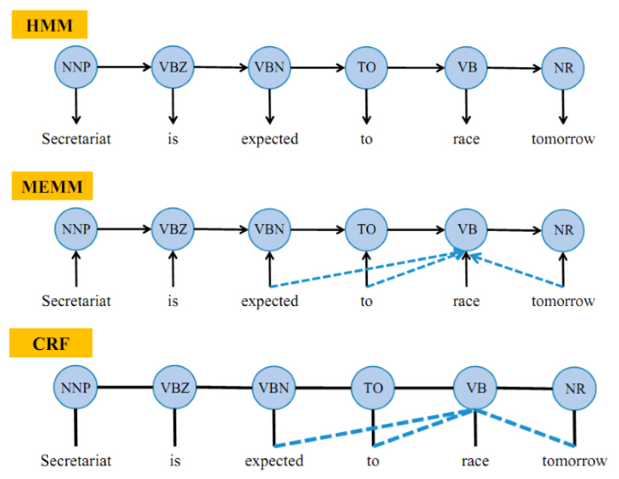

```{r setup, include=FALSE}
knitr::opts_chunk$set(echo = TRUE)
```

# Parts of Speech (PoS)

Dionysius Thrax of Alexandria (c.100 B.C.) wrote a grammatical sketch that summarized the linguistic knowledge of his day. 

Also included are a description of eight parts-of-speech: noun, verb,parts-of-speech pronoun, preposition, adverb, conjunction, participle, and article. Although earlier scholars (including Aristotle) had their own lists of parts-ofspeech,it was Thrax’s set of eight that became the basis for practically all subsequent part-of-speech descriptions of most European languages for the next 2000 years. 

Thrax's original eight have change since then, but not by much.

Parts-of-speech (also known as **POS**) are useful because they reveal a lot about a word and its neighbors. Knowing whether a word is a noun or a verb tells us about likely neighboring words (nouns are preceded by determiners and adjectives, verbs by nouns) and syntactic structure word (nouns are generally part of noun phrases), making part-of-speech tagging a key aspect of parsing. Parts of speech are useful features for labeling named entities like people or organizations in information extraction. A word’s part-of-speech can even play a role in speech recognition or synthesis, e.g., the word content is pronounced CONtent when it is a noun and conTENT when it is an adjective.

# Word Classes

Two categories: **Closed Class** and **Open Class**

Closed-class words have reletively fixed membership. Words tend to be short, occur frequently, and often have structure uses in grammar (i.e. prepositions - new ones are rarely coined)

Open-class words essentially have new words created often. For example, iPhone (noun), Googled (verb).

Any given speaker or corpus could have a wide variety of open-class words, but will likely share the same set of closed-class words.

### Open Class

Four main categories

1. Nouns
2. Verbs
3. Adjectives
4. Adverbs

English has all 4, but some languages do not.

#### 1. Nouns

People, places, and things
- Concrete (ship, actual concrete)
- Abstractions (bandwitdth, relationship)
- Verb-like (Pacing)

Definining a noun in English
- Appear with determiners (a ship, its bandwidth)
- Take possessives (Google's annual revenue)
- Some can occur in plural form (ships, relationships)

Two classes of Open-Class nouns: 

**Proper nouns**

- Specific persons or entities (Regina, IBM, Colorado)
- In English, generally not preceeded by articles (*the book is upstairs*, but *Regina is upstairs*)
- Usually capitalized

**Common nouns**

Count nouns

- Allow gramatical enumeration (boat/boats, relationship, relationships)
- Can actually be counted (one ship, two ships)

Mass nouns

- Conceptualized as a homogenous group (snow, salt, communism)
- Generally not counted (two communisms)
- Can appear without articles (*Snow is white*, but not *Goat is white*)

#### 2. Verbs

Refer to actions and processes (draw, provide, go)
Have Inflections
- Eat
- Eating
- Eaten
- Eaten

Some researchers believe all human languages have categories for nouns and verbs. Riau Indonesian and Tongan don't make a distinction.

#### 3. Adjectives

Properties or qualitites, description
- Color (black, white)
- Age (old, yound)
- Value (good, bad)

#### 4. Adverbs

Extremely varried in both form and meaning. The following sentence has all adverbs italicized:

*Actually*, I ran *home extremely quickly yesterday*

Adverbs often modify verbs... hence the name. However, they can also modify other adverbs and entire verb phrases.

Adverbs can be split into further categories

- **Directional/locative** adverbs specify location (home, here, downhill) 
- **Degree** adverbs specify extent (extremely, very, somewhat) 
- **Manner** adverbs specify manner of some action (slowly, slinkily, delicately)
- **Temporal** adverbs specify when an action or event took place (yesterday, Monday)

Note: given the heterogeneous nature of this class, some adverbs (Monday) are tagged in some tagging schemes as nouns

### Closed Class

Includes

- **Prepositions**: on, under, over, near, by, at, from, to, with 
- **Particles**: up, down, on, off, in, out, at, by 
- **Determiners**: a, an, the 
- **Conjunctions**: and, but, or, as, if, when 
- **Pronouns**: she, who, I, others 
- **Auxiliary verbs**: can, may, should, are 
- **Numerals**: one, two, three, first, second, third

Prepositions occur before noun phrases, often to indicate temporal or spatial relation.

- Literal: *on it*, *before then*
- Metaphorical: *on time*, *beside herself*
- Marking an agent: *Hamlet was written* ***by** *Shakespear*

***
# PoS Tagging

**What is it?**
"Part-of-speech tagging is the process of assigning a part-of-speech marker to each word in an input text" (Jurafsky, 156). 

**Why is it useful?**
- Information Extraction/ Retrieval
- Phrase Identification
- Named Entity Recognition
- Word Sense Disambiguation
- Text to speech (how should a word sound)?

\vspace{14cm}

**Why is it challenging?** 
The challenge in POS-tagging is the ambiguity in words. "The goal of POS-tagging is to *resolve* the ambiguities, choosing the proper tag for the context" (Jurafsky, 156). Ambiguous words account for only 14-15% of the vocabulary, but since they are common words 55-67% of word tokens in running text are ambiguous (Jurafsky, 156). 

Examples of ambiguous frequent words: *that*, *back*, *down*, *put*, and *set*\

-- The **calm** lasted for three days. (Noun)
-- **Calm** words show quiet minds (Adjective)
-- **Calm** your angry friend. (Verb)

\vspace{14cm}

**How are words disambiguated?**\
- Probability; each part-of-speech tag isn't equally likely.\
- Set of rules;

- Most Frequent Class Baseline: for each ambiguous word, choose the tag which is *most frequent* in the training corpus.\
- Aside from the *baseline* we will discuss 4 other methods for POS tagging: Hidden Markov Models, Maximum Entropy Markov Models, Conditional Random Fields, and Rule Based System.\ 

\vspace{14cm}

Accuracy: measure of the performance of part-of-speech taggers (percentage of tags correctly labeled).

***
## PoS Tagging Tools

### Part-of-Speech Tagset's
A key component to tagging text for part-of-speech is the tagset used to label corpora. Several tagset's exist, however the **Penn Treebank** is most common and is sufficient for the purposes of this lesson. Standard notation is to place the tag after each word, deliminated by a slash.\ 

<center>


</center>

\vspace{12pt}

### Tagged Corpora
Corpora labeled with parts-of-speech are crucial training (and testing) sets for statistical tagging algorithms. For English text, there are three tagged corpora that are typically used for training and testing part-of-speech taggers. 

- **Brown corpus**: 1 million words sampled from 500 written texts from different genres published in the U.S. in 1961.
- **WSJ corpus**: 1 million words published in the Wall Street Journal in 1989.
- **Switchboard corpus**: 2 million words of telephone conversations from 1990-1991.

\vspace{12pt}

*For more information on labeled corpora check out:* http://www.helsinki.fi/varieng/CoRD/corpora/index.html

<center>


</center>


\vspace{14cm}

The tagged corpora were created by running an automatic part-of-speech tagger on the texts and then human annotators **hand-corrected** each tag. Minor differences exist between the tagsets used by the corpora. This is worth noting and has the potential to vary part-of-speech tags when applying different tagged corpora. *(We will explore this further on Thursday.)*


# Maximum Entropy Markov Models (MEMM)

One of the limitations of HMM is that it needs *massaging* to deal with unknown words, backoff, suffixes, and such. Maximum Entropy Markov Models (MEMM) deal with this issue by cleanly adding arbitrary features directly into the model.

**How is this done?**
- A logistic regression model
- A logistic regression can be a discriminative sequence model by running it on successive words and allowing the previous output to be a feature for the current instance.

Lets see how this works...(Jurafsky, 168)


- HMMs compute likelihood (observation word conditioned on tags) but MEMMs compute posterior (tags conditioned on observation words).

<center>


</center>


- The reason to use a discriminative sequence model is that it's easier to incorporate a lots of features.

<center>


</center>

<center>



</center>


# Example
First lets install the necessary packages for this example.
