```{r setup, include=FALSE, echo=FALSE}
knitr::opts_chunk$set(echo = TRUE,
                      message = F,
                      warning = F, 
                      comment = NA)
```


#What is Document Summarization
  *Document Summarization* finds the most important information in a document and creates an abridged version. 

* “The ideal of automatic summarization work is to develop techniques by which a machine can generate summarize that successfully **imitate** summaries generated by **human beings**.” [(1)](https://dl.acm.org/citation.cfm?id=554275)

* Summaries should read fluently and stand on their own while preseving key information. [(2)](https://dl.acm.org/citation.cfm?id=2825984)

<center>
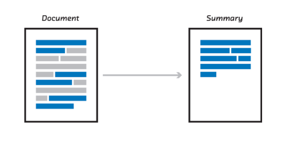 [(2)](https://medium.com/nanonets/topic-modeling-with-lsa-psla-lda-and-lda2vec-555ff65b0b05)
</center>

##Why do we Need Document Summarization
*	Summaries reduce reading time.
*	When researching documents, summaries make the selection process easier.
*	Automatic summarization improves the effectiveness of indexing.
*	Automatic summarization algorithms are less biased than human summarizers.
*	Personalized summaries are useful in question-answering systems as they provide personalized information.

##Examples of Document Summarization in Everyday Use. 
*	Headlines (from around the world)
*	Outlines (notes for students)
*	Minutes (of a meeting)
*	Previews (of movies)
*	Synopses (soap opera listings)
*	Reviews (of a book, CD, movie, etc.)
*	Digests (TV guide)
*	Biography (resumes, obituaries)
*	Abridgments (Shakespeare for children)
*	Bulletins (weather forecasts/stock market reports)
*	Sound bites (politicians on a current issue)
*	Histories (chronologies of salient events)
*	Medical (Patient history/symptoms)


#Two Main Approaches to Document Summarization: 
## *Extractive Methods & Abstractive Methods*
<center>
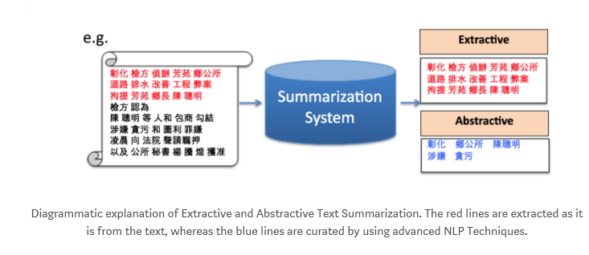 [(3)](https://medium.com/the-ai-herald/a-qualitative-introduction-to-automatic-text-summarization-30f025c853c0)
</center>

##Extractive
* Techniques perform summarization by picking portions of texts and constructing a summary
*	Key phrase extraction
*	Summarizes without modification
*	Uses statistical and linguistic features to create summaries

Tasks for extractive

* Generic summarization
* Query relevant summarization

###Graph Base:
  Model makes the graph from the document, then summarizes it by considering the relation between the nodes (text-unit). The graph is constructed by creating a vertex for each sentence in the document.
  
  <center>
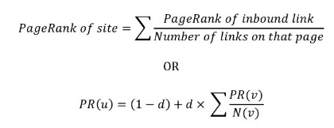 [(4)](https://github.com/icoxfog417/awesome-text-summarization#basic-approach)
</center>

  
####Page Rank:
<center>
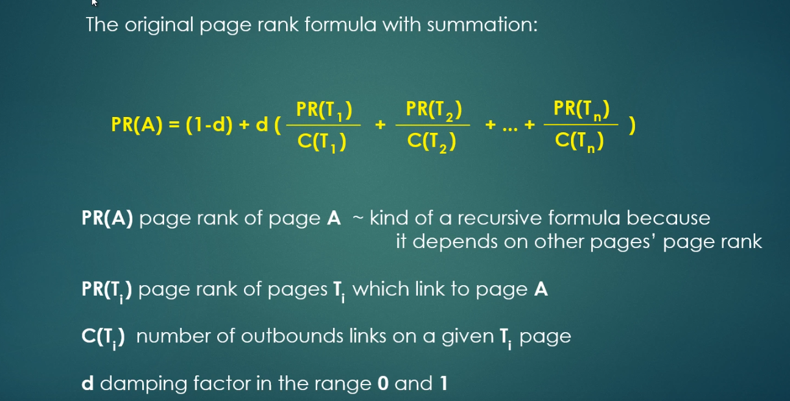 
</center>
<center>
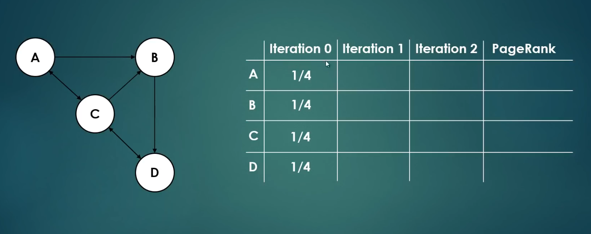 
</center>
<center>
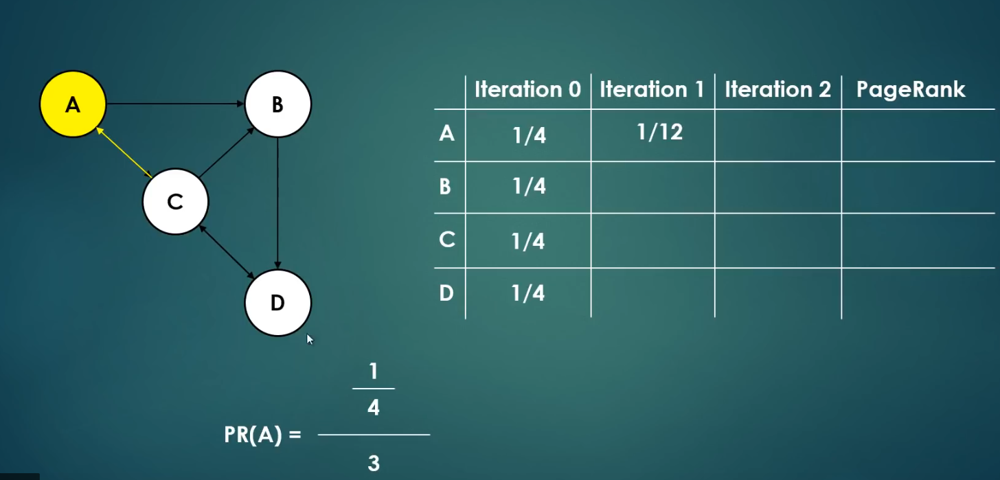 
</center>
<center>
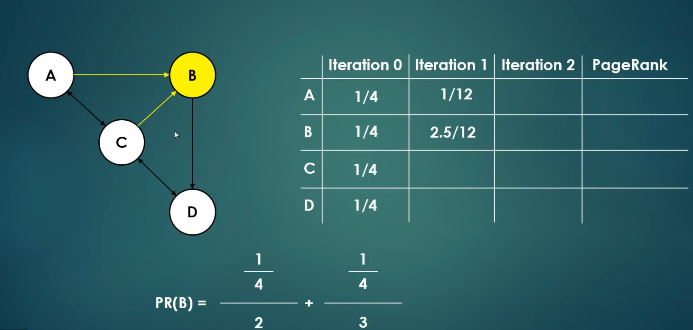 
</center>
<center>
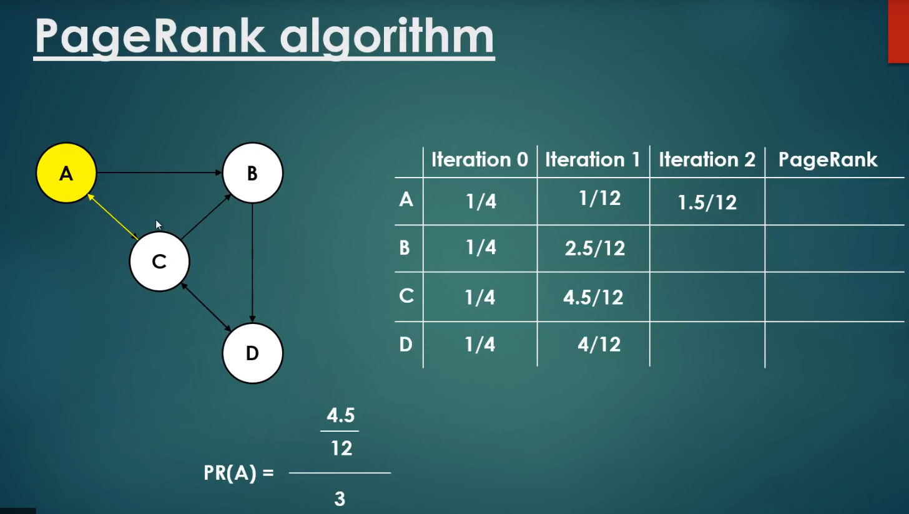 
</center>
<center>
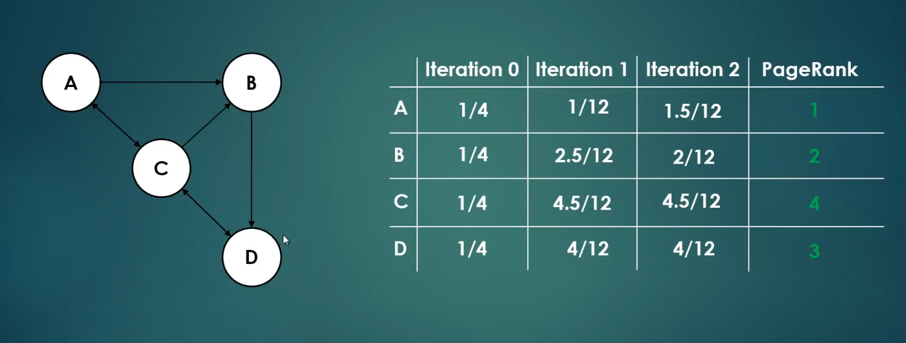 
</center>
<center>
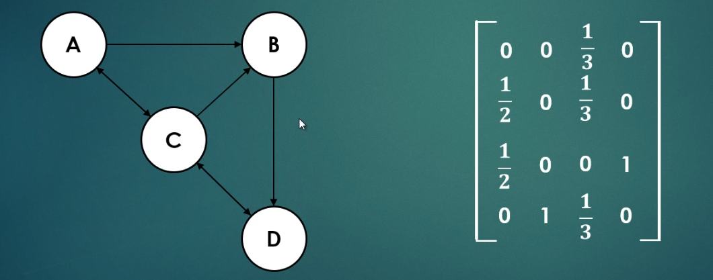 
</center>

The damping factor is included to prevent pages with no outgoing links from absorbing the Page Ranks of connected pages. The example we went over had a damping factor of 0. 

<center>
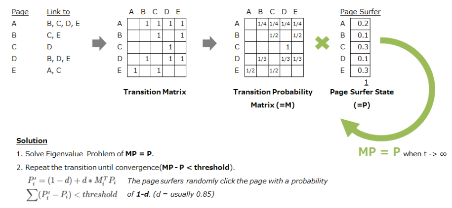 [(4)](https://github.com/icoxfog417/awesome-text-summarization#basic-approach)
</center>

#### *Method:* Text Rank
  Based on PageRank algorithm used by Google Search Engine. The basic premise is a linked page has higher value if it is linked from many linked pages.


  TextRank considers *words* or sentences as “pages” on the PageRank and a similarity measure supplements the transition matrix. The measure is based on the number of words two sentences have in common and is normalized by the sentences' lengths.
  

#### *Method:* LexRank
  Uses cosine similarity of TF-IDF vectors

  First generates graph of all the sentences in the corpus. Each sentence represents a node and the edges are the similarity relationship between all sentences in the corpus. The following formulation is used to measure the similarity. 

<center>
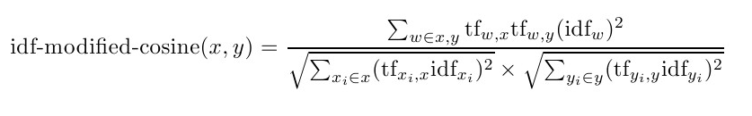 
</center>

  This measures the distance between two sentences (x and y). The more similar the sentence, the closer x and y are located.

  The similarity measure is then used to build a similarity matrix, which can be used as **a similarity graph between sentences**. The LexRank algorithm measure the **importance** of sentences in the graph by considering its **relative importance to its neighboring sentences**, where a *positive* contribution will raise the importance of a sentence’s neighbor, while a *negative* contribution will lower the importance value of a sentence’s neighbor.

<center>
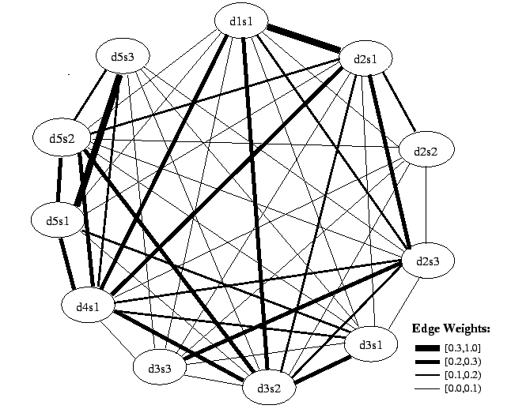 [(5)](https://www.cs.cmu.edu/afs/cs/project/jair/pub/volume22/erkan04a-html/erkan04a.html)
</center>

  To **extract** the most important sentences, from the resulting similarity matrix we apply a **thresholding mechanism**. A threshold value is used to filter out the relationships between sentences whose weights are fall **below the threshold**. The result is a **subset** of the similarity graph, from where we can pick one node that has the highest number of degree. This **node** is considered **salient** or represents a **summary sentence** of the corpus.[(6)](https://blog.nus.edu.sg/soctalent/2010/02/11/a-brief-summary-of-lexrank-graph-based-lexical-centrality-as-salience-in-text-summarization/)


###Feature Based
  Model Extracts the features of a sentence, then evaluates its importance.

Some examples of features are:

*	Position of the sentence in input document
*	Presence of the verb in the sentence
*	Length of the sentence
*	Term frequency
*	Named entity tag NE
*	Font style
The features are then combined as a score

#### *Method:* Luhn

  Luhn proposed that the most frequent words represent the most important concept of a text. His process gives each sentence a score based on the number of occurrences of words and choosing the sentence with the highest score. 

### Topic Base
  Calculates the topic of the document and evaluates the sentences by topics included.

#### *Method:* Laten Sematic Analysis (LSA)
  LSA takes an input matrix and performs singular value decomposition (SVD) to identify patterns in the relationship and similarity between the terms and sentences. LSA summarization algorithms usually contain 3 main steps. 

Step 1: Create the input matrix, which has each row represents the word and each column is a sentence. The cell value represents the importance of the word which can be filled using either frequency of word, TF-IDF, log entropy, etc.  

Step 2: SVD breaks up the input matrix into three new matrices as follows:
$$
A = USV^T
$$
where A is the original *m* by *n* input matrix; U is words x extracted concepts; S represents scaling values, diagonal descending matrix; and V is sentences x extracted concepts. 

Step 3: Sentence selection by using the results of SVD. 

Ex: Three sentences are given as an input to LSA

S1: “The man walked the dog”

S2: “The man took the dog to the park”

S3: “The dog went to the park”

  Using the Gong and Lui algorithm for sentence selection we inspect the *$V^T$* matrix

$$\begin{array}
{rrrr}
 & S1 & S2 & S3 \\
Concept 1 & 0.457 & *0.728* & 0.510 \\
Concept 2 & -0.770 & 0.037 & 0.637
\end{array}
$$
  In *$V^T$*  matrix, row order indicates the importance of the concepts, therefore the first row indicates the most important concept. In this example, sentence 2 is determined to contain the most important concept. 

  LSA has several limitations. The first drawback of LSA is it has difficulty handling words with multiple meanings depending on the context. The second is that it does not use information about word order, syntactic relations, and morphologies. Lastly, with larger and more inhomogeneous data the performance of LSA decreases sharply due to SVD.

### Grammar Base
  Parses the text and constructs grammatical structure, and then reorders the substructures. Analyzing grammatical structure is useful in preserving a meaning in a phrase.

<center>
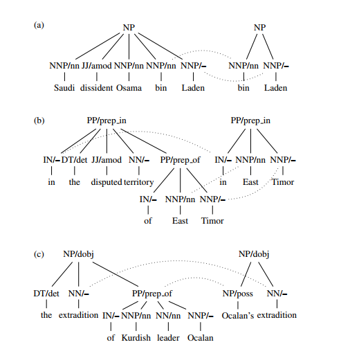 
</center>
"In the disputed area of East Timor"

##Abstractive
*	Conceptualizes a summary and paraphrases it.
*	Requires use of natural language generation technology (growing field).
*	Requires deep understanding of text
*	Recent success of sequence-to-sequence models, in which recurrent neural networks (RNNs) both read and freely generate text, has made abstractive summarization viable.

  It may help to imagine Extractive techniques as highlighting words, phrases, or sentences in order to summarize the document while Abstractive techniques are more like using a pen to write a summary in your own words. Having computers write an abstractive summary proves to be much more complicated than extractive techniques but methods like Recurrent Neural Networks have the potential to be extremely power!

### Recurrent Neural Networks

  Recurrent Neural Networks (RNN) are a type of neural netowrk that performs calculation on sequential data (like words in a sentence).  [(7)](http://www.abigailsee.com/2017/04/16/taming-rnns-for-better-summarization.html)

  Lets examine a quick example of an RNN for a simple sentence:

*"Germany emerge victorious in 2-0 win against Argentina on Saturday"*

  Now we can look at the diagram below to see how an RNN might be able to look at the sentence to summarize it. 

<center>
 [(7)](http://www.abigailsee.com/2017/04/16/taming-rnns-for-better-summarization.html)
</center>

  Once the encoder has read in the text, the decoder RNN begins to find words and place them in sequence based what the RNN was trained on.  In this case, the RNN is able to pick up the starting subject (Germany) and uses the words **victorious** and **win** to come up with the word **beat** as the next part of the summary.  The message will proceed through the message until a proper summary has been produced. 

#### Problems with the RNN
  It may seem like its doing a pretty good job summarizing the document, however, two large problems present themselves:
*Problem 1* - The summaries sometimes reproduces factual detail inaccuratly (such as the score of the soccer match) because these are rare words or words that do not appear in the voculary network.  
*Problem 2* - The RNN can sometimes get caught in a loop repeating the same words or phase over and over again (e.g. Germany beat Germany beat Germany beat...) [(7)](http://www.abigailsee.com/2017/04/16/taming-rnns-for-better-summarization.html)

  If you want additional information as to how RNNs get around these problems, please see the online article where this information and diagram was collected [here.](http://www.abigailsee.com/2017/04/16/taming-rnns-for-better-summarization.html) This article does an execellent job explaining the basics of document summarization using Recurrent Neural Networks

  The topic of Recurrent Neural Networks is extremely vast and a potentially powerful tool to produce detailed abstractive summaries if done in the proper way.  

#Conclusion

  Document summarization is very important and relevat in today due to the vast amount of documents out there. While people may not have the time to read through and summarize each document, computers via text mining are able to do it much quicker. Each technique is better at summarizing different types of documents. Next class we will get into some examples in R on how to use this software to summarize documents. While the software does most of the heavy lifting, data preprocessing is vital in order for the packages to run properly.  

# References

1. [Advances in Automatic TextSummarization](https://dl.acm.org/citation.cfm?id=554275) 
2. [Innovative Document Summarization Techniques: Revolutionizing Knowledge Understanding](https://dl.acm.org/citation.cfm?id=2825984)
3. [Diagrammatic explanation of Extractive and Abstractive Text Summarization](https://medium.com/the-ai-herald/a-qualitative-introduction-to-automatic-text-summarization-30f025c853c0)
4. [Graph Base Math](https://github.com/icoxfog417/awesome-text-summarization#basic-approach)
5. [Lex Rank Graphic](https://www.cs.cmu.edu/afs/cs/project/jair/pub/volume22/erkan04a-html/erkan04a.html)
6. [A Brief Summary of Lexrank Graph Based Lexical Centrality as Salience in Text Summarization](https://blog.nus.edu.sg/soctalent/2010/02/11/a-brief-summary-of-lexrank-graph-based-lexical-centrality-as-salience-in-text-summarization/)
7. [Taming Reccurent Neural Networks for Better Summarization](http://www.abigailsee.com/2017/04/16/taming-rnns-for-better-summarization.html)