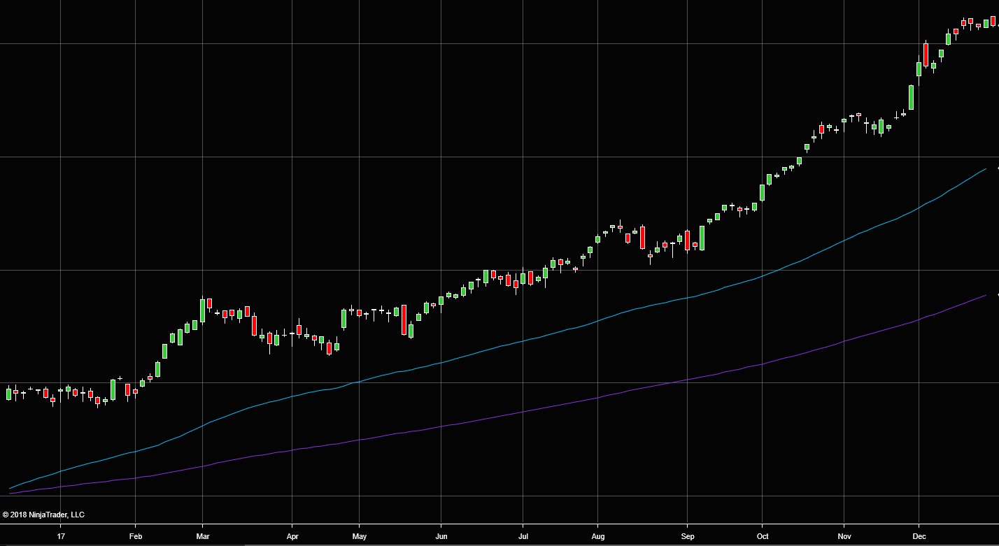
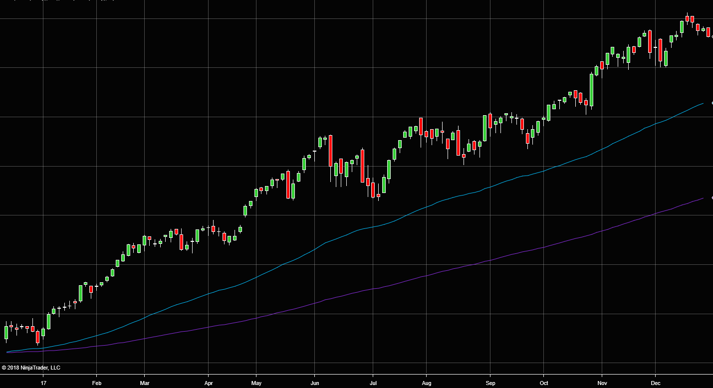
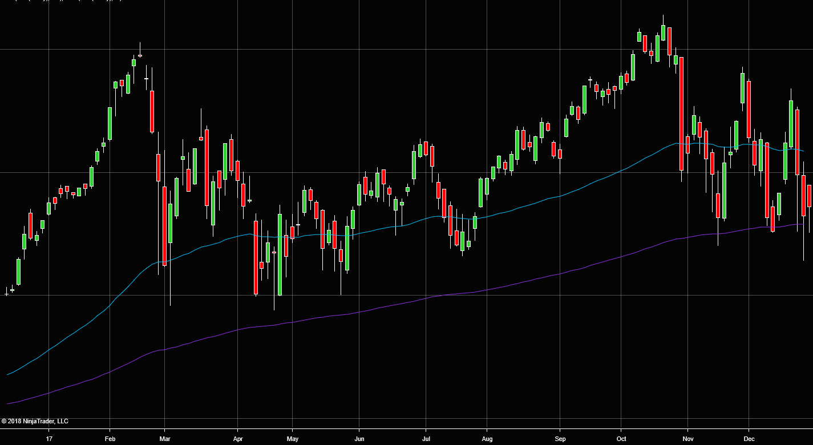
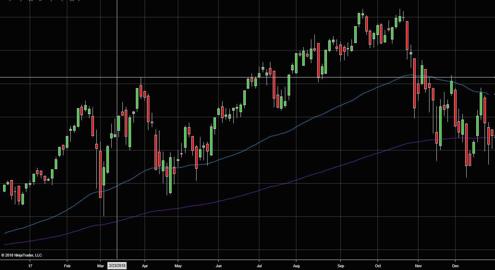

```{r setup, include=FALSE, echo=FALSE}
knitr::opts_chunk$set(echo = TRUE,
                      message = F,
                      warning = F, 
                      comment = NA,
                      fig.pos = 'h')
```

## Project Overview/Problem Statement 

Natural Language processing (NLP - or more commonly known as "text mining") is the application of computer algorithms to textual documents, with the overall end goal of gaining insight and possibly interpreting meaning. Simply put - text mining is essentially the process of computers reading text. 

Computerized reading of text documents has its advantages. Computers can read and store text much faster than humans. Computers do not get tired or bored. Computers may also detect underlying relationships within text, providing more insight into a topic than human readers alone.

Computerized reading of text also has its disadvantages. Computers are literal, possibly having a hard time interpreting sarcasm. Computers could skip over misspelled words, resulting in meaning being lost. Essentially, computers do exactly what they're told, meaning the system is only as smart as programmed. However, they still can be useful.

Out of the growing set of research areas in NLP, sentiment analysis is the focus of this research. Sentiment analysis is the process of computerized reading of a text document to interpret some sort of sentiment, usually positive or negative. The computer "reads" the document and assigns a value or category to each word. The values/categories are then summed at the end of each document to produce an overall score. These specific methods used are discussed in the analysis section of this report.

Sentiment analysis can therefore be useful for reading documents that are time-sensitive - the faster a document is read and interpreted, the greater probability for a potential edge. This holds true nowhere else more than in the financial world, where the concept of time is literally money. The quick internalization of financial and economic data is paramount to any successful money manager. 

Eight times a year, the U.S. Federal Reserve publishes their "Beige Book," which is typically a 30+ page report of the current economic well-being of the United States. This book is always published at 1400 Eastern time on days when the U.S. stock market is open, meaning those who trade the market have two hours to read and internalize this document before markets close at 1600. Those two hours after the document is published can be very volatile, making smart investment decisions during this time difficult as traders read and react. One method to possibly make it easier to position for future growth would be to use sentiment analysis.

Given the historic market volatility following the document's release, this research sets out to find a method, using sentiment analysis, of reading and internalizing the Federal Reserve’s Beige Book with the intent to forecast the economic well-being of the U.S. economy in the days and months following release. 

### Installing Loading Required R Packages

In order to begin (or simply follow along with this research), the following packages need to be installed.

```{r, warning=FALSE, message=FALSE}
pacman::p_load(rprojroot,
               tidytext,
               tidyr,
               dplyr,
               ggplot2,
               tidyverse,
               glue,
               stringr,
               wordcloud)
```

## Methodology 

For this research, the years 2017 and 2018 were considered, equating to 16 Beige Books. These years were chosen in an attempt to capture all directions of the market. In 2017, the U.S. stock market experienced a significant increase in value, where the economics of the U.S. were generally considered sound. However, 2018 has been marred by volatility and decline. 

The tidyverse provides easy functionality to implement sentiment analysis. Specifically, the library offers four method overloads for use (more commonly known as "lexicons"). These lexicons provide different methods for determining sentiment, and are described below:

- afinn: produces a value from -5 to 5, with 5 being extremely positive. This is the only lexicon that results in numbers.
- bing: words can be either "positive" or "negative"
- loughran: contains definitions for "positive" or "negative", but also "litigious", "uncertainty", "constraining", and "superfluous"
- nrc:  contains definitions for "positive" or "negative", but also "anger", "anticipation", "disgust", "fear", "joy", "sadness", "surprise", and "trust"

For this research, all four lexicons are considered. However, those capable of classifying additional words outside of "positive" and "negative" will not have that specific functionality utilized. For the non-numeric lexicons ("bing", "loughran", "nrc") the number of "positive" and "negative" occurrences will be counted, and a final sentiment score will be determined by taking the difference of the two. For the only numeric lexicon ("afinn"), a simple summation of scores will be made.

Once all 16 Beige Books are analyzed, the resulting sentiment trend will be compared to the overall trend in the U.S. stock market, using the Dow Jones Industrial Average and the SP 500 as benchmarks. 

### Data 

The Beige Book is published on the Federal Reserve's website: https://www.federalreserve.gov/monetarypolicy/beige-book-default.htm. The Beige Book is also published in two formats: HTML and pdf. This research and following code examples use the pdf version of the document. The pdf is read into R as is, where no additional processing of the document is required. 

Below is a direct quote from the most recent Beige Book:

>Overall Economic Activity
Most of the twelve Federal Reserve Districts reported that their economies expanded at a modest or moderate pace
from mid-October through late November, though both Dallas and Philadelphia noted slower growth compared with the
prior Beige Book period. St. Louis and Kansas City noted just slight growth. On balance, consumer spending held
steady – District reports on growth of nonauto retail sales appeared somewhat weaker while auto sales tended to improve,
particularly for used cars. Tourism reports varied but generally kept pace with the economy. Tariffs remained a
concern for manufacturers, but a majority of Districts continued to report moderate growth in the sector. All Districts
reported growth in nonfinancial services – ranging from slight to strong. New home construction and existing home
sales tended to decline or hold steady, while construction and leasing of nonresidential structures tended to rise or
remain flat. Overall, lending volumes grew modestly, although a few Districts noted some slowing. Agricultural conditions
and farm incomes were mixed; some Districts noted impacts from excessive rainfall and from tariffs, which have
constrained demand. Most energy sectors saw little change or modest growth. Most Districts reported that firms remained
positive; however, optimism has waned in some as contacts cited increased uncertainty from impacts of tariffs,
rising interest rates, and labor market constraints.

## Analysis

In order to properly deal with the data, the location of all 16 Beige Books are read-in and held in a list. Holding these document locations in a list will make iterative reading and analyzing easier.

```{r, warning=FALSE, message=FALSE}
root <- find_root(is_rstudio_project)
dest <- file.path(root, 'BeigeBooks')
my_files <- list.files(path = dest, 
                       pattern = "pdf",  
                       full.names = TRUE)
```

Now that our document locations are stored, the next step is to read-in the documents and store them as text. For simplicity, the following methods will only read-in one document (Beige Book 20170118), with an iterative example shown later.

```{r, warning=FALSE, message=FALSE}
bookText <- pdftools::pdf_text(pdf = my_files[1])
```

The bookText object now holds all text from the first Beige Book (my_files[1]), and is stored by page. Using the function head() allows us to view the text from only the first page.

```{r, warning=FALSE, message=FALSE}
head(bookText, 1)
```

Having all the text listed by page can be helpful, but for this analysis pages will not matter. Therefore, bookText is then tokenized, or broken down simply by line and not page. This means every page is stored on a single line.

```{r, warning=FALSE, message=FALSE}
  tokens <- data_frame(text = bookText)
```

However, storing each page by line is still somewhat cumbersome to deal with. Therefore, we must first unnest these tokens, or break these lines down into words. Here, each word is now stored on a new row.

```{r, warning=FALSE, message=FALSE}
tokens <- data_frame(text = bookText) %>% 
    unnest_tokens(word, text) 
```

Using the function head() again, we can view the first 11 words of this document.

```{r, warning=FALSE, message=FALSE}
head(tokens, 11)
```

Using the function count() displays how many words are in the document.

```{r, warning=FALSE, message=FALSE}
count(tokens)
```

However, our document still contains stop words. Stop words are words that don't add much meaning to the document. Common stop words would be the articles ("a", "an", "the") and can be removed with the funtion anti_join(stop_words). The final call looks like this:

```{r, warning=FALSE, message=FALSE}
tokens <- data_frame(text = bookText) %>% 
  unnest_tokens(word, text) %>%
  anti_join(stop_words)
```

Viewing the first 11 words in the document now reveals,

```{r, warning=FALSE, message=FALSE}
head(tokens, 11)
```

with the final count of the remaining words:

```{r, warning=FALSE, message=FALSE}
count(tokens)
```

As can be seen, the function removed the stop words "for", "use", and "on" from the beginning of the document, and an additional 6,336 stop-words thereafter. 

Now that the data is read into a format we can work with, we can now apply sentiment analysis to our document. The lexicon "bing" will be used first.

```{r, warning=FALSE, message=FALSE}
sentimentBing <- tokens %>%
  inner_join(get_sentiments("bing")) %>% 
  count(sentiment)

sentimentBing
```

The function get_sentiments("bing") returned a tibble containing both positive and negative scores for the document. In this case, the document had more positive words than negative ones, which is often true with delicate financial data. In order to get a final score, the difference between the two must be taken. Furthermore, additional steps are needed to get the data in a more useful form.

```{r, warning=FALSE, message=FALSE}
sentimentBing <- tokens %>%
  inner_join(get_sentiments("bing")) %>% 
  count(sentiment) %>%
  spread(sentiment, n, fill = 0) %>%
  mutate(sentiment = positive - negative) %>%
  mutate(file = basename(my_files[1])) %>%
  mutate(YYYYMM = as.numeric(str_match(my_files[1], "\\d{6}"))) %>%
  mutate(method = "bing")

sentimentBing
```

Now we have a table with all our data in the same row and separated by columns. This will make it easier to add new observations in the future. Notice additional columns for overall sentiment, file name, and the month/year of the document were added.

Next, we can use the previous code to apply the "nrc" lexicon. However, remember that the "nrc" lexicon has additional categories outside of "positive" and "negative". Therefore, we must filter out the words we do not need with the function filter().

```{r, warning=FALSE, message=FALSE}
sentimentNRC <- tokens %>%
  inner_join(get_sentiments("nrc")) %>%
  filter(sentiment %in% c("positive", "negative")) %>%
  count(sentiment) %>%
  spread(sentiment, n, fill = 0) %>% 
  mutate(sentiment = positive - negative) %>%
  mutate(file = basename(my_files[1])) %>%
  mutate(YYYYMM = as.numeric(str_match(my_files[1], "\\d{6}"))) %>%
  mutate(method = "nrc")

sentimentNRC
```

Becasue both "sentimentBing" and "sentimentNRC" have the exact same columns, we can bind them together to produce one large sentiment data-frame to house all of the observations.

```{r, warning=FALSE, message=FALSE}
sentiment <- rbind(sentimentBing, sentimentNRC)

sentiment
```

Using the same document for both "bing" and "nrc", "nrc" calculates the sentiment as much more positive.

Next, we can apply the previous "nrc" code and use the "loughran" lexicon.

```{r, warning=FALSE, message=FALSE}
sentimentLoughran <- tokens %>%
  inner_join(get_sentiments("loughran")) %>%
  filter(sentiment %in% c("positive", "negative")) %>%
  count(sentiment) %>%
  spread(sentiment, n, fill = 0) %>% 
  mutate(sentiment = positive - negative) %>%
  mutate(file = basename(my_files[1])) %>%
  mutate(YYYYMM = as.numeric(str_match(my_files[1], "\\d{6}"))) %>%
  mutate(method = "loughran")

sentiment <- rbind(sentiment, sentimentLoughran)

sentiment
```

Here, the "loughran" lexicon marks the document as slightly less than neutral.

Finally, the last lexicon "afinn" is considered. However, this lexicon produces only numeric outputs and therefore the original code must be altered.

```{r, warning=FALSE, message=FALSE}
sentimentAFINN <- tokens %>%
  inner_join(get_sentiments("afinn")) %>% 
  group_by(index = word ) %>%
  summarise(sentiment = sum(score))

sentiment <- rbind(sentiment, c("N/A", 
                                "N/A", 
                                sum(sentimentAFINN$sentiment), 
                                basename(my_files[1]), 
                                as.numeric(str_match(my_files[1], "\\d{6}")),
                                "afinn"))

sentiment
```

Given the "afinn" lexicon is numeric, only the total sum from the function is recorded.

The results above were somewhat tedious for just one document, let alone 16. Therefore, an easier way to analyze all 16 Beige Books is needed. This can be accomplished through writing a function.

Because the variable "my_files" contains the location to all the Beige Books in the folder, we can use this as an input argument to our function. We can then simply copy-and-paste the above code chunks into our new function. We will name our function "GetSentiments"

```{r, warning=FALSE, message=FALSE}
GetSentiments <- function(file){
  
  bookText <- pdftools::pdf_text(pdf = file)
  
  tokens <- data_frame(text = bookText) %>% 
    unnest_tokens(word, text) %>%
    anti_join(stop_words)
  
  sentiment <- tokens %>%
    inner_join(get_sentiments("bing")) %>% 
    count(sentiment) %>%
    spread(sentiment, n, fill = 0) %>%
    mutate(sentiment = positive - negative) %>%
    mutate(file = basename(file)) %>%
    mutate(YYYYMM = as.numeric(str_match(file, "\\d{6}"))) %>%
    mutate(method = "bing")
  
  sentimentsNRC <- tokens %>%
    inner_join(get_sentiments("nrc")) %>%
    filter(sentiment %in% c("positive", "negative")) %>%
    count(sentiment) %>%
    spread(sentiment, n, fill = 0) %>% 
    mutate(sentiment = positive - negative) %>%
    mutate(file = basename(file)) %>%
    mutate(YYYYMM = as.numeric(str_match(file, "\\d{6}"))) %>%
    mutate(method = "nrc")
  
  sentiment <- rbind(sentiment, sentimentsNRC)
  
  sentimentsL <- tokens %>%
    inner_join(get_sentiments("loughran")) %>%
    filter(sentiment %in% c("positive", "negative")) %>%
    count(sentiment) %>%
    spread(sentiment, n, fill = 0) %>% 
    mutate(sentiment = positive - negative) %>%
    mutate(file = basename(file)) %>%
    mutate(YYYYMM = as.numeric(str_match(file, "\\d{6}"))) %>%
    mutate(method = "loughran")
  
  sentiment <- rbind(sentiment, sentimentsL)
  
  sentimentAFINN <- tokens %>%
    inner_join(get_sentiments("afinn")) %>% 
    group_by(index = word ) %>%
    summarise(sentiment = sum(score))
  
  sentiment <- rbind(sentiment, c("N/A", 
                                  "N/A", 
                                  sum(sentimentAFINN$sentiment), 
                                  basename(file), 
                                  as.numeric(str_match(file, "\\d{6}")),
                                  "afinn"))
  
  sentimentsNRC <- tokens %>%
    inner_join(get_sentiments("nrc")) %>%
    filter(sentiment %in% c("positive", "negative")) %>%
    count(sentiment)
  
  return(sentiment)
}
```

Now that we have a function to perform all four sentiment analysis lexicons, we can simply iterate over all 16 files using a for loop.

```{r, warning=FALSE, message=FALSE}
sentiments <- data_frame()

for(i in my_files){
  sentiments <- rbind(sentiments, GetSentiments(i))
}

sentiments
```

At this point, all sentiment analysis scores from the 16 Beige Books are now stored in one tibble. Having everything in one place allows us to graph easily using ggplot().

```{r fig.width=14, fig.height=8, fig.align='center', fig.cap="Sentiment - 2017:2018", warning=FALSE, message=FALSE}
ggplot(sentiments, aes(group = method, x = YYYYMM, y = sentiment, color = method)) + 
  geom_line() + 
  geom_vline(xintercept = 9) +
  geom_smooth(method = "auto")
```

Now that we have a visual representation of each lexicon's sentiment score over time, we are now ready to make comparisons to our baselines: the Dow Jones Industrial Average (DJIA) and the SP 500. Note the black vertical line (used to split the two years of observations).

## Findings

In order to make comparisons, the data will be split into two separate years for graphical analysis - comparisons will first be made against 2017 data, then the same for 2018. This is because both the DJIA and the SP 500 had very different characteristics in 2017 vs. 2018. 

### 2017

First, let’s consider 2017. Both the DJIA and the SP 500 experienced large growth in 2017, displaying a somewhat linear trend upward. Volatility in this year was relatively small, and most investors would consider 2017 to be a good year for the U.S. economy. Below are the charts for both the DJIA and SP 500 in 2017:

```{r fig.align='center', fig.cap="Dow Jones Industrial Average - 2017", warning=FALSE, message=FALSE, echo=FALSE}


```

```{r fig.align='center',, fig.align='center', fig.cap="SP500 - 2017", warning=FALSE, message=FALSE, echo=FALSE}


```

Both indexes experienced very little variation over the year.

Now, to make a comparison using the Beige Books, we filter our sentiment data on 2017, which results in the following:

```{r fig.width=14, fig.height=8, fig.align='center', fig.cap="Sentiment - 2017", warning=FALSE, message=FALSE, echo=FALSE}
sentiments %>%
  filter(YYYYMM < 201801) %>%
  ggplot(aes(group = method, x = YYYYMM, y = sentiment, color = method)) + 
  geom_line() + 
  geom_vline(xintercept = 9) +
  geom_smooth(method = "auto")

```

Using the smoothed line as our basis, the lexicons "afinn", "bing", and "nrc" all agree in direction considering the first six Beige Books of 2017. For the first four books, these three lexicons identified a positive trend in sentiment, and for the subsequent two all agree on a negative trend. For Beige Books seven and eight, only "afinn" and "nrc" agree on a positive direction, where "bing" continues its negative trend. Making a comparison to the index charts above, there was not a negative trend at all in 2017. 

A divergence here between Beige Book sentiment and market trends is not surprising and can be explained by the endless market analysis at that time: many investors had no idea why the markets were doing so well so fast. Many considered the markets overbought, meaning their true value was somewhere below their current trading price. Another term for being overbought is a "bubble," and many analysts then believed the U.S. economy was entering one. If the U.S. markets did enter a bubble in the second half of 2017, then the three lexicons mentioned previously correctly identified this entry. However, only the lexicon "bing" held firm with the overall decline in sentiment, with "afinn" and "nrc" finishing the year with more positive sentiment. 

The lexicon "loughran," missing from the previous statements, did not agree with the other three at any discernable level, and only matched "bing" near the end of the year. This could be because the sentiments used by "loughran" have overlap. "Loughran" has "positive" and "negative" sentiment, but also "litigious", "uncertainty", "constraining", and "superfluous. These remaining sentiments are all generally negative, which indicates this lexicon might have a negative bias. 

### 2018

For the markets, 2018 has been a tumultuous year. At the time of this writing, the DJIA has erased all gains since the start of the year, with volatility levels being very high. Below are the charts for both the DJIA and SP 500 in 2018:

```{r out.width='100%', fig.align='center', fig.cap="Dow Jones Industrial Average - 2018", warning=FALSE, message=FALSE, echo=FALSE}


```

```{r fig.align='center',, fig.align='center', fig.cap="SP500 - 2018", warning=FALSE, message=FALSE, echo=FALSE}


```

Both indexes experienced wild price swings over the year and are close to ending up at or below their starting levels.

For a comparison, the Beige Book sentiments from all four lexicons are shown below.

```{r fig.width=14, fig.height=8, fig.align='center', fig.cap="Sentiment - 2018", warning=FALSE, message=FALSE, echo=FALSE}
sentiments %>%
  filter(YYYYMM > 201801) %>%
  ggplot(aes(group = method, x = YYYYMM, y = sentiment, color = method)) + 
  geom_line() + 
  geom_vline(xintercept = 9) +
  geom_smooth(method = "auto")

```

Unlike the sentiment trend in 2017 where lexicons displayed various levels of agreement, 2018 displayed much more variance among lexicons. The lexicon "nrc" was generally positive and ended the year with a more positive sentiment than it started. Both "afinn" and "bing" ended the year with a more negative sentiment than started, with "afinn" diverging and ending the year more positive than the previous two books it analyzed. "Bing" continued its negative trend all the way through. The lexicon "loughran" did display variation in its sentiment scores over the year, but scale here became an issue (the plotting technique used seems to have trouble with negative numbers). 

##Word Clouds

Considering the overall sentiment trend can be helpful in making investment decisions but knowing exactly which words are driving the scores is still not clear. Therefore, in order to get a more granular view within each Beige Book, word clouds were generated in hopes of providing more insight.

Generating word clouds using the entire dataset would provide an overall idea of which words appear most but would not provide much insight into each Beige Book. Therefore, a single book was chosen to analyze with word clouds. In determining which specific books to analyze, we'll first refer to 2017 where the markets were gaining (implying sound economic fundamentals). In order to capture the most upward potential of 2017, the first Beige Book (published in Jan) was chosen to analyze first.


```{r  fig.width=3, fig.height=3, fig.align='center', fig.cap="nrc sentiment - Beige Book 201701", warning=FALSE, message=FALSE, echo=FALSE}
bookText <- pdftools::pdf_text(pdf = my_files[1])

tokens <- data_frame(text = bookText) %>% 
  unnest_tokens(word, text) %>%
  anti_join(stop_words)

sentimentsNRC <- tokens %>%
  inner_join(get_sentiments("nrc")) %>%
  filter(sentiment %in% c("positive", "negative")) %>%
  count(word) %>%
  with(wordcloud(word, n, max.words = 150))
```

```{r  fig.width=3, fig.height=3, fig.align='center', fig.cap="loughran sentiment - Beige Book 201701", warning=FALSE, message=FALSE, echo=FALSE}
bookText <- pdftools::pdf_text(pdf = my_files[1])

tokens <- data_frame(text = bookText) %>% 
  unnest_tokens(word, text) %>%
  anti_join(stop_words)

sentimentsL <- tokens %>%
  inner_join(get_sentiments("loughran")) %>%
  filter(sentiment %in% c("positive", "negative"))%>%
  count(word) %>%
  with(wordcloud(word, n, max.words = 150))
```

```{r fig.width=3, fig.height=3, fig.align='center', fig.cap="afinn sentiment - Beige Book 201701", warning=FALSE, message=FALSE, echo=FALSE}
bookText <- pdftools::pdf_text(pdf = my_files[1])

tokens <- data_frame(text = bookText) %>% 
  unnest_tokens(word, text) %>%
  anti_join(stop_words)

sentimentAFINN <- tokens %>%
  inner_join(get_sentiments("afinn")) %>%
  count(word) %>%
  with(wordcloud(word, n, max.words = 150))
```

```{r fig.width=3, fig.height=3, fig.align='center', fig.cap="bing sentiment - Beige Book 201701", warning=FALSE, message=FALSE, echo=FALSE}
bookText <- pdftools::pdf_text(pdf = my_files[1])

tokens <- data_frame(text = bookText) %>% 
  unnest_tokens(word, text) %>%
  anti_join(stop_words)

sentimentBing <- tokens %>%
  inner_join(get_sentiments("bing")) %>%
  count(word) %>%
  with(wordcloud(word, n, max.words = 150))

```

The largest words being the ones that appear most, words like "growth," "strong," and "steady" are all highlighted. These are words that are reflective of a strong economy. However, there are smaller words that indicate not all is well - words like "declined," "sluggish," "weak," and "shortages" make their appearance. Overall, the trend is positive, but the usage of these words, albeit in low numbers, is troubling. However, recall the markets did experience large gains after this Beige Book was released, so its possible investors chose to only focus on the good (also an indication of entering overbought/bubble territory).

Moving on to 2018, the months from May to October experienced a relatively linear upward trajectory. However, this trend ended at the end of October with November and December having high levels of volatility. Therefore, the Beige Book released in the second half of October will be considered. Word clouds on all four lexicons were produced for analysis.  

```{r  fig.width=3, fig.height=3, fig.align='center', fig.cap="nrc sentiment - Beige Book 201810", warning=FALSE, message=FALSE, echo=FALSE}
bookText <- pdftools::pdf_text(pdf = my_files[15])

tokens <- data_frame(text = bookText) %>% 
  unnest_tokens(word, text) %>%
  anti_join(stop_words)

sentimentsNRC <- tokens %>%
  inner_join(get_sentiments("nrc")) %>%
  filter(sentiment %in% c("positive", "negative")) %>%
  count(word) %>%
  with(wordcloud(word, n, max.words = 150))
```

```{r  fig.width=3, fig.height=3, fig.align='center', fig.cap="loughran sentiment - Beige Book 201810", warning=FALSE, message=FALSE, echo=FALSE}
bookText <- pdftools::pdf_text(pdf = my_files[15])

tokens <- data_frame(text = bookText) %>% 
  unnest_tokens(word, text) %>%
  anti_join(stop_words)

sentimentsL <- tokens %>%
  inner_join(get_sentiments("loughran")) %>%
  filter(sentiment %in% c("positive", "negative"))%>%
  count(word) %>%
  with(wordcloud(word, n, max.words = 150))
```

```{r fig.width=3, fig.height=3, fig.align='center', fig.cap="afinn sentiment - Beige Book 201810", warning=FALSE, message=FALSE, echo=FALSE}
bookText <- pdftools::pdf_text(pdf = my_files[15])

tokens <- data_frame(text = bookText) %>% 
  unnest_tokens(word, text) %>%
  anti_join(stop_words)

sentimentAFINN <- tokens %>%
  inner_join(get_sentiments("afinn")) %>%
  count(word) %>%
  with(wordcloud(word, n, max.words = 150))
```

```{r fig.width=3, fig.height=3, fig.align='center', fig.cap="bing sentiment - Beige Book 201810", warning=FALSE, message=FALSE, echo=FALSE}
bookText <- pdftools::pdf_text(pdf = my_files[15])

tokens <- data_frame(text = bookText) %>% 
  unnest_tokens(word, text) %>%
  anti_join(stop_words)

sentimentBing <- tokens %>%
  inner_join(get_sentiments("bing")) %>%
  count(word) %>%
  with(wordcloud(word, n, max.words = 150))

```

Again, prominent words like "growth" and "strong" make appearances. However, negative economic words like "modest," "slowed," "shortages," and "decline" are all present. We also see words like "hurricane" and "tariff," two economic events that were quite prominent in 2018. 

Also, notice the word "increased." Increased, without further context, is ambiguous. In a positive sense, "increased" could be used to describe wages, which is a good thing. However, it could also be used to describe unemployment, which is generally bad. Depending on how the word was used would determine its sentiment score - something these lexicons do not consider.  

## Conclusions

Predicting market moves is a difficult endeavor. No single source of data exists that contains all information investors use to make decisions, which in turn determines market direction. However, the results here are compelling. No single lexicon was able to predict moves perfectly, but "bing" was very much in line with personal experience. "Bing" was able to identify market weakness in the first half of 2017 and continued its downward prediction for many Beige Books thereafter. The lexicon "afinn" also did a fine job of scoring, predicting market weakness in September 2018 (nearly two months before increased market volatility). Given the strengths and weaknesses of each lexicon, using them in concert would be more insightful. 

Using word clouds also illuminated which words appeared most in our lexicons, providing a deeper level of granularity than just overall sentiment scores alone. However, as noted earlier, ambiguous words could throw off the final sentiment score. 

## Future Work

Sentiment analysis on economic text is helpful, but further tweaking of the lexicons would be needed. Specifically, these lexicons only consider one word each time it scores. Scoring bigrams and trigrams could provide a deeper understanding of phrases and entire sentences. To do this, parts-of-speech tagging would be useful. 

Furthermore, non-numeric lexicons that have additional sentiment categories other than "positive" and "negative" could have these extra categories classified as "positive" or "negative." This would allow for a deeper understanding, as the fidelity of these lexicons would be improved. Otherwise, much of the data is left uncategorized and sentiment unknown.

This analysis considered Beige Books as a single document, interpreting sentiment over the entire document instead of in pieces. Determining sentiment change over the entire book would be more insightful, as the book is written with different sections in mind. Specifically, the book has an overall economic assessment, then delves further into each of the 12 Federal Reserve districts across the U.S. A more robust analysis would calculate sentiment for each district, highlighting both healthy and declining areas of the country.

